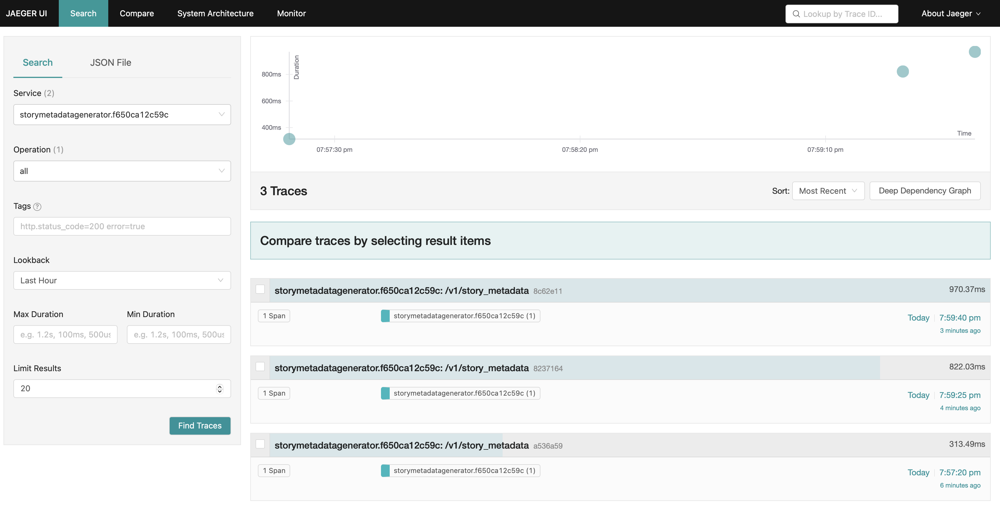
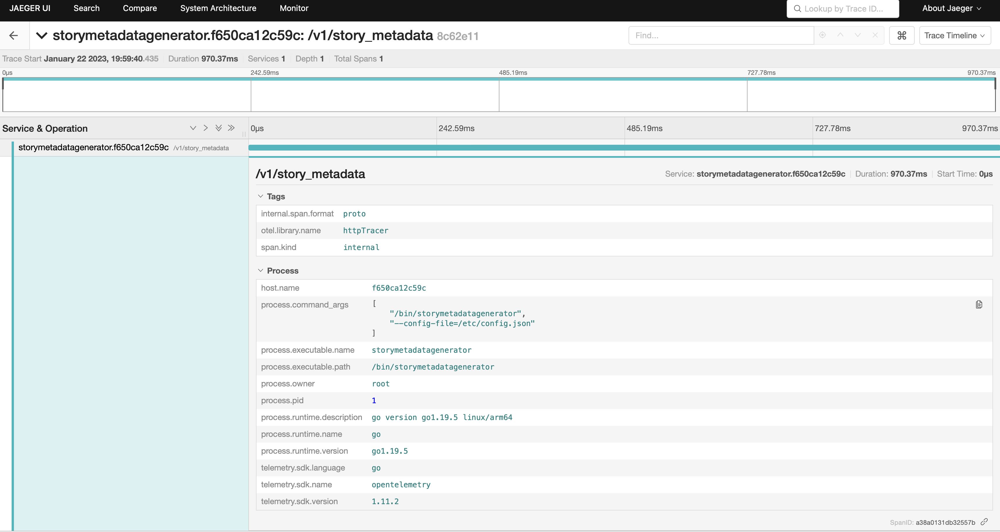
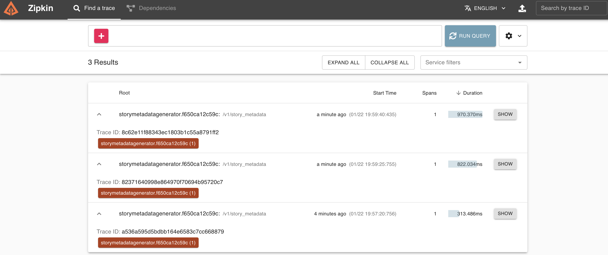

# StoryMetadataGenerator

A Go service that generates metadata about stories pulled from the Axios Story Stream.

### Set Up and Run

You can start `storymetadatagenerator` in a terminal window or by building and running the required docker containers. See [docker-compose.yaml](./docker-compose.yaml) for a list of these contaniers and their configuration.

To start the service run:

```
make docker-start
```

`storymetadatagenerator` will start an http server on port 8080 and grpc server on port 8081. Optionally, you can override the default configuration via the [config.json](./config.json) file. The config file ([config.json](./config.json)) is automatically passed as an argument to the `make start` and `make docker-start` commands (see [setup and run](#set-up-and-run)) and must be present in the project root to build.  See [config.example.json](./config.example.json) for an example of what values can be overridden.
For a description of each config value, build an executable (see [Build](#Build)) and run:

```
./storymetadatagenerator -h
```

Run `make docker-down` to stop all containers.

### Build

To build an executable for your target architecture, run:

```
make build
```
The build command will run the tests and place an executable labeled `storymetadatagenerator` in the project root. This executable must be provided with the path to the [config.json](./config.json) file to run properly. See example below:

```
./storymetadatagenerator --config-file=./config.json
```

Please note that running the service this way (or via `make start`) requires that the supporting docker containers (otel-collector, jaeger-all-in-one, zipkin-all-in-one, and prometheus) are running for the service to start. Use `make docker-start` to start all the containers then manually stop the `storymetadatagenerator-storymetadatagenerator-server-1` container so there are no port conflicts.

### Test

The `make start` command will automatically run the tests. If you need to run the tests outside of this command, run `make docker-start` before executing the individual tests. Run `make docker-down` to teardown the containers after your tests have completed.

A code coverage report can be generated by running the following command:

```
make cover
```

Additionally, you can use `make covero` to generate a code coverage report and immediatly open the report in a web browser.

Code coverage output is stored [here](/.coverage)

### Http Server

The http server exposes two endpoints:

| Method | URI                | Name                                            | Input                                                                              | Summary                                                                                                                                                                        |
| ------ | ------------------ | ----------------------------------------------- | ---------------------------------------------------------------------------------- | ------------------------------------------------------------------------------------------------------------------------------------------------------------------------------ |
| GET    | /status            | [get status](./internal/server/http.go)         | None.                                                                              | Returns 20 OK if server is ready to accept requests.                                                                                                                           |
| GET    | /v1/story-metadata | [get story-metadata](./internal/server/http.go) | Source: Body. Number of story pages to retrieve. Defaults to 1 if '0' is provided. | Generates Story metadata for 'N' requested story stream pages. Returns story metadata for each story that completed sucessfully and a list of errors for stories that did not. |

### Grpc Server

The protocol buffers for the Grpc server can be found [here](./api/v1/grpc/storymetadata.proto)

### JaegerUI

Traces are collected via an opentelemetry collector and sent to an instance of JagerUI running on port 16681.





### ZipkinUI

Traces are collected via an opentelemetry collector and sent to an instance of ZipkinUI running on port 9411.



### TODO

A list of tasks that I would have liked to incorporate in my solution but did not have the time to can be found [here](./TODO.md).

### Assumptions

I thought it would be more efficient to continue processing the story stream pages even if one story encountered an error. Therefore, the response from both the Http server and the Grpc server return the following JSON:

```
{
"stories": {
    "03aa8c72-7007-46c0-b35c-d3cefdb5aee9": {
      "word_count": 235,
      "reading_time": "<1",
      "headline": "Manchin on 2024 political ambitions:",
      "permalink": "https://www.axios.com/2023/01/22/joe-manchin-2024-senate-democrats"
    },
  },
"errors": {},
}
```

Errors are ommited form the response if the `errors` field is empty. I chose this approach to provide more flexibility for the comsuming service to determine how individual story errors should be handeled.

Please feel free to email me at [koneal2013@gmail.com](mailto:koneal2013@gmail.com) with questions regarding my solution.

